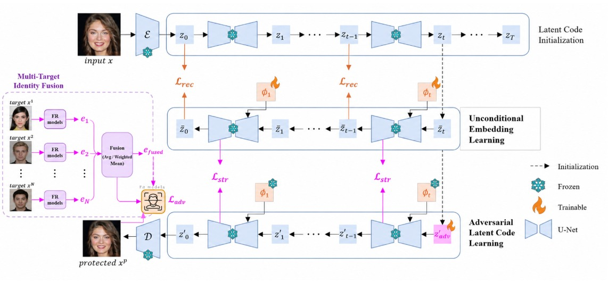

# Privacy-Preserving Face Generation using Diffusion Models


A diffusion-based facial privacy protection framework that generates privacy-preserving face images using **Multi-Target Identity Blending**. The proposed approach reduces identity leakage by optimizing towards a fused identity representation while maintaining facial realism.

---

# Overview

Face recognition systems have become increasingly accurate, making facial privacy a growing concern. Traditional diffusion-based privacy protection methods optimize towards a **single target identity**, which can unintentionally cause the protected image to resemble that target.

This project proposes a **Multi-Target Identity Fusion** framework that blends multiple identity embeddings to generate an ambiguous identity representation. The framework integrates this fusion strategy into a Stable Diffusion adversarial optimization pipeline to improve privacy protection while preserving image quality.

---

# Features

- Multi-Target Identity Fusion
- Stable Diffusion-based Face Generation
- DDIM Inversion
- ArcFace Identity Embeddings
- Adversarial Latent Optimization
- Structural Consistency using Attention Guidance
- High Protection Success Rate (PSR)
- Privacy-Preserving Face Generation

---

# Problem Statement

Current facial privacy protection approaches suffer from:

- Identity leakage due to single-target optimization
- Reduced robustness against face recognition models
- Poor balance between privacy and image quality

This project solves these issues by generating an **ambiguous identity embedding** obtained by averaging multiple target identities before adversarial optimization.

---

## Proposed Architecture



---

# Methodology

The complete pipeline consists of the following stages:

1. Face Alignment
2. Source Identity Embedding Extraction
3. Multiple Target Identity Selection
4. Identity Fusion
5. DDIM Latent Inversion
6. Diffusion-based Adversarial Optimization
7. Reverse Diffusion
8. Protected Image Generation

---


# Tech Stack

| Category | Technologies |
|----------|--------------|
| Language | Python |
| Deep Learning | PyTorch |
| Diffusion Model | Stable Diffusion |
| Vision | OpenCV |
| Face Recognition | ArcFace |
| Libraries | NumPy, Transformers, Diffusers, Matplotlib |

---

# Dataset

**CelebA-HQ**

High-resolution facial image dataset used for evaluating privacy-preserving image generation.

---

# Evaluation Metrics

- Protection Success Rate (PSR)
- Cosine Similarity
- Structural Similarity Index (SSIM)
- Peak Signal-to-Noise Ratio (PSNR)
- Frechet Inception Distance (FID)

---

# Experimental Results

| Metric | Score |
|---------|-------|
| PSR @ FAR=0.01 | **1.00** |
| PSR @ FAR=0.001 | **0.90** |
| SSIM | **0.7609** |
| PSNR | **23.65 dB** |
| FID | **73.47** |

---

# Installation

## Clone Repository

```bash
git clone https://github.com/yourusername/privacy-preserving-face-generation.git

cd privacy-preserving-face-generation
```

## Create Environment

```bash
conda create -n face-privacy python=3.11

conda activate face-privacy
```

## Install Dependencies

```bash
pip install -r requirements.txt
```

---

# Dataset Structure

```text
assets/

├── datasets/
├── face_recognition_models/
│   ├── facenet.pth
│   ├── ir152.pth
│   ├── irse50.pth
│   └── mobile_face.pth
│
├── target_images/
├── obfs_target_images/
└── test_images/
```

---

# Usage

## Step 1: Align Images

```bash
python align.py
```

## Step 2: Generate Privacy-Protected Images

```bash
python main.py --target_choices "1,2,3"
```

---

# Available Arguments

| Argument | Description |
|-----------|-------------|
| source_dir | Source images |
| test_dir | Images to protect |
| target_choices | Target identities |
| is_obfuscation | Enable obfuscation |
| adv_optim_weight | Adversarial loss weight |

---

# Future Work

- Adaptive Identity Fusion
- Dynamic Target Selection
- Faster Diffusion Sampling
- Real-time Privacy Protection
- Video Face Anonymization
- Cross-model Robustness

---

# References

- Enhancing Facial Privacy Protection via Weakening Diffusion Purification
- DiffProtect
- ArcFace
- Stable Diffusion
- DDIM

---

# Acknowledgements

This work is inspired by recent advances in diffusion-based facial privacy protection and extends existing approaches through **Multi-Target Identity Fusion** for reducing identity leakage.


